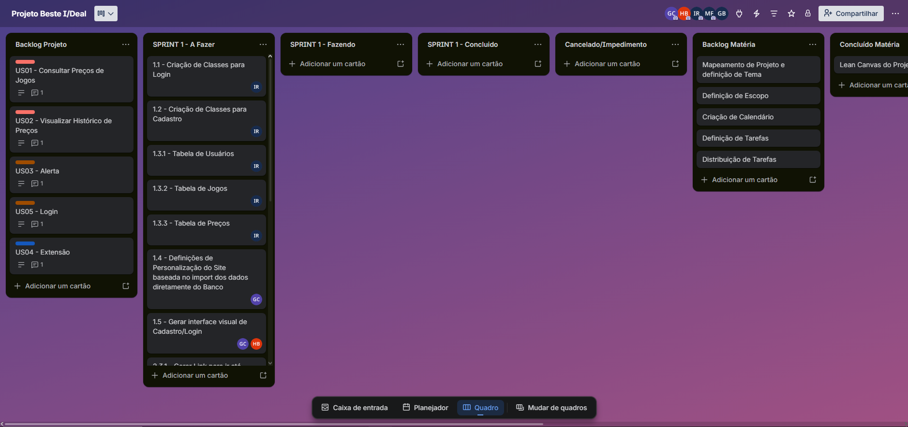

# Lab 05 - Gerenciamento de Tarefas e Quadro Kanban (Sprint 1)

---

## 1. Objetivo da Sprint 1
O objetivo desta sprint é implementar o **MVP (Minimum Viable Product)** operacional do sistema I-Deal, focando na infraestrutura de acesso (Autenticação), no núcleo de busca de preços e na sincronização inicial de dados das lojas parceiras.

**Capacidade Planejada:** 224 horas (4 integrantes x 80h x 0,7 de produtividade).

---

## 2. Decomposição das Histórias em Tarefas Técnicas
Para garantir o acompanhamento granular, cada História de Usuário (User Story) selecionada do Lab 04 foi decomposta em tarefas de Front-end, Back-end, Banco de Dados e Testes.

### [US01] Consultar Preços de Jogos (UC01)
* **[BD]** Modelagem e criação das tabelas de Jogos e Preços.
* **[Back-end]** Implementação das queries de busca fonética no MongoDB e SteamDB.
* **[Front-end]** Desenvolvimento da barra de busca e dos cards de exibição de ofertas.
* **[Testes]** Teste de integração entre interface e API de busca.

### [US05] Autenticar Usuário (UC06)
* **[BD]** Criação da tabela de Usuários com suporte a hashes de segurança.
* **[Back-end]** Implementação da lógica de negócio para Login e Cadastro.
* **[Front-end]** Interface visual para formulários de acesso e registro.
* **[Testes]** Validação de fluxos de login com credenciais inválidas.

### [US06] Sincronizar e Normalizar Dados (UC04)
* **[Back-end]** Script de importação de dados (SteamDB, GOG, Epic).
* **[Back-end]** Algoritmo de normalização de títulos (Strings matching).
* **[Front-end]** Implementação do link de redirecionamento para o varejista.
* **[BD]** Armazenamento de logs de navegação e histórico inicial.

---

## 3. Evidência do Quadro (Trello)

